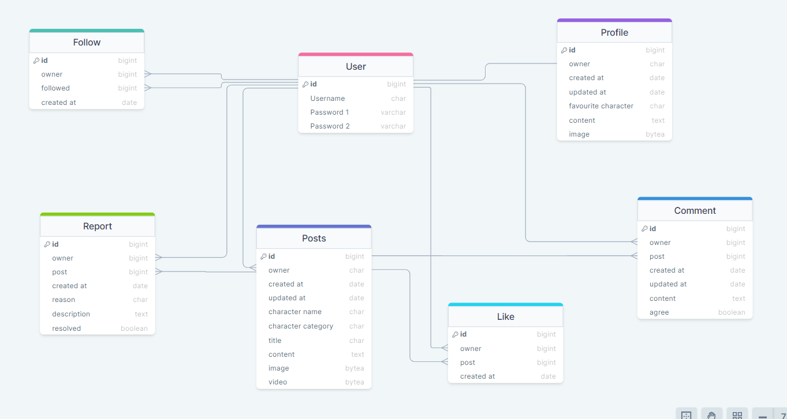

# Stongest Avenger DRF API

## Overview

Strongest Avenger API is designed for a specific React frontend project so that the user is able to create an account, update there own profile, make posts whether it be an image or video of there favourite marvel character, comment on others posts, like a post, agree with a post and follow other users. 
The user is also able to view different posts by whether they are the posts they like, they are posts by another user they follow or they are the posts by how they have decided to search for posts.

## Project Goals

This is part of my fifth  portfolio project for the Code Institute and the goal with this project is to display my new skills in using frameworks such as Django Rest (for the API backend) and React (for the frontend). I have decided to build a social website where users are able to create accounts and make posts on their favourite Marvel characters. The User can also comment, like and agree on others posts and being able to follow other users to see their posts.

## Content

- [Strongest Avenger DRF API](#strongest-avenger-drf-api)
  - [Overview](#overview)
  - [Project Goals](#project-goals)
  - [Planning](#planning)
    - [Data Models](#data-models)
  - [API Endpoints](#api-endpoints)
  - [Technologies Used](#technologies-used)
    - [Languages Used](#languages-used)
    - [Frameworks and Tools Used](#frameworks-and-tools-used)
    - [Libraries Used](#libraries-used)
  - [Testing](#testing)
  - [Deployment](#deployment)

## Planning

Planning started by using agile methodologies by delivering small features across the duration of the project. This broke down the build of the project into a lot more manageable parts and was able to select which user stories were more important to the site. The userstories were then used to help create wireframes to see how the user would navigate and use the app. This can all be seen in more details in the React frontend repository.
These were then used to help work out the required API endpoints to support the desired functionality of the site.

dfjdfjd endpoint diagram go here????

### Data Models

Data model schema was planned with the API endpoints, using an entity relationship diagram to show how the models were related.

The custom models in Strongest Avenger DRF API are:

***Profile***

The Profile model is linked using a one to one relationship with the built in User model in conjunction with Django Allauth, with the user profile being created automatically when the user registers an account.
The user then is able to edit their own profile with their name, favourite character, profile image and content about themselves.

***Posts***

The Posts model is linked to the User model by foreign key using a one to many relationship, this allows for posts to be linked back to the specific user and their profile.
The user when making a post can also write the character name of who they are posting, what category the character would come under, title, content and then select eeither an image or a video to post.

***Comment***

The Comment model is linked to the Posts model by foreign key using a one to many relationship to store comments for a specific post.
The Comment model is also linked to the User model by foreign key using a one to many relationship to allow for comments to be linked back to a specific user and their profile.
When the user is making a comment on a post they they can also select whether they a agree or not that the character in the post is the strongest avenger.

***Follow***

The Follow mode is linked to the User model by foreign key using a one to many relationship. This is the case for both fields owner and followed. These fields have related names "following" and "followed". This allows the user to follow multiple users and also have multiple users following them.
The Model also makes sure that a user can not follow or be followed by a user multiple times.

***Like***

The Like model is linked to the User model by foreign key using a one to many relationship so that any likes can be linked back to a specific user and their profile.
The Like model is also linked to the Post model by foreign key using a one to many relationship to store likes for a specific post.
The model also makes sure that a user can not like the same post twice.

***Report***

The Report model is linked to the User mode by foreign key using a one to many relationship so that any reports can be linked back to a specific user and their profile.
The Report model is also linked to the post Post model by foreign key using a one to many relationship to so that any reports can be linked back to the post with the issue.
In the Report model the user will also be provided a select choices for the reason for the report and a description to explain.
There is also a Boolean field top select whether the issue has been resolved, this is strictly for admin to select once they have resolved the issue.

An entity relationship diagram was created using drawSQL to show the schemas for each of the models and how they are related:

[back to top](#strongest-avenger-drf-api)

## API Endpoints

| URL | HTTP Method | CRUD Operation | View name |
| --- | --- | --- | --- |
| `Profile Endpoints` |
| /profiles | GET | List all profiles | LIST |
| /profiles/:id | GET | Retrieve a profile by id | DETAIL |
| /profiles/:id | PUT | Edit / update profile by id | DETAIL |
| ` Posts Endpoints` |
| /posts | GET | List of all posts | LIST |
| /posts | POST | Create a post | LIST |
| /posts/:id | GET | Retrieve a post by id | DETAIL |
| /posts/:id | PUT | Edit / update a post by id | DETAIL |
| /posts/:id | DELETE | Delete a post by id | DETAIL |
| ` Comment Endpoints` |
| /comments | GET | List of all comments | LIST |
| /comments | POST | Create a comment | LIST |
| /comments/:id | GET | Retrieve a comment by id | DETAIL |
| /comments/:id | PUT | Edit / update a comment by id | DETAIL |
| /comments/:id | DELETE | Delete a comment by id | DETAIL |
| `Follow Endpoints` |
| /followers | GET | List of all followers | LIST |
| /followers | POST | Create a new follower | LIST |
| /followers/:id | GET | Retrieve follower by id | DETAIL |
| /followers/:id | PUT | Edit / Update follower by id | DETAIL |
| /followers/:id | DELETE | Delete follower by id | DETAIL |
| `Like Endpoints` |
| /likes | GET | List of all likes | LIST |
| /likes | POST | Create a like | LIST |
| /likes/:id | GET | Retrieve like by id | DETAIL |
| /likes/:id | DELETE | Delete like by id | DETAIL |
| `Report Endpoints` |
| /report | POST | Create a new report | LIST |

[back to top](#strongest-avenger-drf-api)

## Technologies Used

### Languages Used

- Python

### Frameworks and Tools Used

- Django Rest Framework
  - Django Rest Framework was used as the main python framework in the development of this project.
- ElephantSQL
  - ElephantSQL was used for the production database.
- Cloudinary
  - Cloudinary was used to store the images and videos posted.
- Gitpod
  - Gitpod was used to write the code.
- Github
  - Github was used to store the projects code after being pushed from Gitpod.
- Heroku
  - Heroku was used for deployment.
- DrawSQL
  - DrawSQL was used to draw out the entity relationship diagram.

### Libraries Used

- Django - A python pakage for the django rest framework.
- Django Allauth - An integrated set of applications used for user authentication, registration and account management.
- Django rest auth - Provides REST API endpoints for login and logout.
- django rest framework-simplejwt - Used for JSON web token authentication.
- psychopg2 - Database adapter to enable interaction between Python and PostgreSQL database.
- django cors headers - This Django app adds CORS headers to responses, to enable the API to respond to requests from origins other than it's own host.
- Cloudinary - Used to store images and videos.
- Pillow - Used for image processing.
- Django Signal - Used to create a profile everytime a user is created.
- moviepy - Used to validate the length of video posted.
- python magic - Used to check if post being created contains image or video.
- gunicorn - Used to help run application.
- django filter - Used to help filter searches.

[back to top](#strongest-avenger-drf-api)

## Testing

I have included details of my testing during and post development in a seperate file called [TESTING.md](TESTING.md)

[back to top](#strongest-avenger-drf-api)

***GitHub***

This project was developed by using a specialized code institute template which is set up to run in Gitpod.

- Once loaded the template provided by code institute, in the top right of the file click on the green drop-down menu labelled "code".
- Then select HTTPS.
- Next copy the URL given to you.
- Next I loaded up Gitpod and clicked on the "Dashboard" at the top right of the page.
- Next, I clicked on "new workspace" on the right hand side of the page.
- In the repository URL, paste in the URL copied from the GitHub account.
- Next clicked on the respository in the drop down menu.
- Next, once the repository was selected I clicked continue and the workspace was now loading.

***Version Control***

For version control the following steps were made:

- If any changes were made to my Gitpod project.
- First files were made ready for commit with command - git add filename or git add . to add all files.
- To commit the changes using the following command - git commit -m "This is my commit" Note the brief description at the end of the command to make you aware of what changes have occurred.
- To then move the changes to GitHub, use the following command - git push

***Clone Repo***

Creating a clone allows you to make a copy of the repository at the specific point in time. This lets you run a copy of the project locally. This can be done by:

- Navigate to the repository you choose to clone in your GitHub.
- Clicking on the arrow of the green button named "Code" at the top of the file.
- Then select "Local" then under local select "HTTPS" and then copy that URL.
- Navigate to your code editor and within the terminal change the directory to the location you wish to clone the repository to.
- Type "git clone" and paste the copied HTTPS link from GitHub.
- Press enter and git will clone the repository to your local machine.

***Forking the GitHub Repository***

Forking the GitHub repository allows you to make a copy of the original repository on your GitHub account to view and make changes without it effecting the original repository. This can be done by:

- Log in to your GitHub account and locate the repository you wish to fork.
- Near the top of the page, under the "settings" button going across the page, you should see a button saying "Fork".
- Click the "Fork" button and you should now have a copy of the original repository in your GitHub account.

***Deployment to Heroku***

For deployment to Heroku the following steps were made:

- First sign in to your Heroku account.
  - On the top right of the page there is a drop-down menu called "new", click this and click on "create new app".
  - You then need to decide your unique app name using '-' between each word. Then select which region you are working from and then click on the button "create app".
  - Once you have clicked on "create app" you will be taken to a new page. On this page you will see a row of tabs at the top left of the page. You first need to click on the "settings" tab and go to the settings page.
  - Login into your ElephantSQL account and create a new instance.
  - Next name your project and select the tiny turtle plan, then click select region.
  - Select the data center near to you then click review.
  - Check the options you selected the click create instance.
  - Once ElephantSQL instance created, click on the instance created and there you will see the URL, which you can copy ready to be placed in the heroku app.
  - You will also need to log into your Cloudinary account, there you can select the dashboard option. In there you will see your Cloudinary URL, you will also need this for the heroku app. You can copy this by clicking on the eye symbol next to it.
  - If you have any code that you have kept private which has been prevented from loading to your GitHub, then you must click on the button "Reveal Config Vars". A small table will then appear with columns "key" and "value". Config Vars used:
    - CLOUDINARY_URL: (Enter Cloudinary API URL)
    - DATABASE URL: (Enter the database URL from ElephantSQL)
    - SECRET_KEY: (Enter your secret key)
    - ALLOWED_HOST: (Enter the deployed Heroku app URL)
  - I then went back to the tabs row at the top of the page and clicked on the "Deploy" tab to take me to the deploy page.
  - On the deployment page, I scrolled down to deployment method and confirmed I wanted to deploy through GitHub.
  - When I click on GitHub a search bar will appear underneath which will allow me to search for my GitHub repository. I made sure I spelt the repository I'm searching for exactly as I named it and then clicked the search button.
  - The repository then appeared underneath my search, I checked this was the correct repository and then clicked the "connect" button. This has now linked up my Heroku app and my GitHub repository code.
  - I then scrolled down to the button "Enable Automatic Deploys", this allows my Heroku app to automatically update every time I've pushed a new change to my code to GitHub. This is optional.
  - I then scrolled down and clicked on the button "Deploy Branch" which is now building the app.
  - Once the app is successfully deployed, a message appeared saying "your app was successfully deployed." Then click on the "view" button which will take me to the deployed link.

[Back to top](#royal-sam-golf-club)

## Credits

- Code Institute - Provided the template for Gitpod so that I was able to build this project. Also, without the knowledge gained through out doing the course I would not have been able to build this project. The tutor support was also very helpful.
- Slack - The slack community help me search for any issues I came across and build this project.
- Django Rest Framework - For being able to use Django Rest Framework to build my project and all the documentation to help build and set up correctly.
- Cloudinary - For storing the data for my posts.
- StackOverflow - For helping give me an idea on how I could make my models work.
- StackOverflow / Cloudinary - For helping figure out how I post images and videos to the correct storage in Cloudinary.
- Allauth - For being able to use their templates.
- Google - For use of all images in the project.
- Mentor Jubril - For helping me realise what's needed to build a good project and also for encouragement and understanding.

[Back to top](#royal-sam-golf-club)