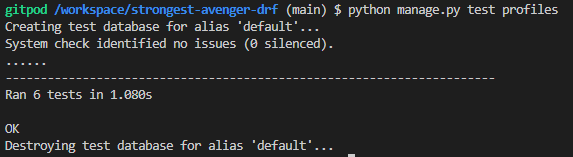

# Stongest Avenger DRF API

## Testing Overview

During and post development of this project numerous testing was carried out by myself.

## Contents

- [Strongest Avenger DRF API](#stongest-avenger-drf-api)
  - [Testing Overview](#testing-overview)
  - [Contents](#contents)
  - [Manual Testing](#manual-testing)
  - [Automated Testing](#automated-testing)
  - [Validators](#validators)
    - [CI Python Linter](#ci-python-linter)

## Manual Testing

Manual testing was carried out throughout the project, making sure the site was functioning correctly.

Full test table:

| Feature | Expected Outcome| Testing Performed | Result | Pass / Fail |
| --- | --- | --- | --- | --- |
|`Profiles`|
| Profile is created when user is created. | When a user is created, the profile for the user is automatically created. | Created a superuser and view the profiles URL to see if it was created. | Went to the profiles URL and the profile was created. | Pass |
| Get list of profiles. | I am able to retrieve a list of all the profiles on the profiles URL page. | Went to the profiles URL. | On the profiles URL could see a list of all the profiles made. | Pass |
| Retrieve profile by id. | In the URL I can search for the profile by adding it's id number. | In the URL I add the id number following the profiles/. |  Only one profile on display which was the correct id number. | Pass |
| If user is logged in they can edit their profile. | When the user is logged in they are able to edit their own profile. | Logged in as a user and attempted to edit the profile. | Once logged in and on the correct profile, an edit form appeared underneath the profile and I was able to edit the profile details. | Pass |
| User can't edit anothers profile. | When user logged in and retrieve anothers profile, the edit form does not appear and user is unable to edit their profile. | Logged in as a user and retrieved a profile which wasn't that users profile. | The update form was not on the screen and was unable to edit their profile. | Pass |
| Profile edit form doesn't appear when logged out. | When a user is logged out and retrieves a profile by id, the profiles update form does not appear. | Remained logged out and retrieved a profile by id. | The profile update form was not on display. | Pass |
| `Posts` |
| Get a list of all posts. | I am able to retrieve a list of all the posts created on the posts URL page. | Went to the posts URL. | On the posts URL I could see a list of all the posts that had been made. | Pass |
| Logged in user can create a post. | When a user is logged in and on the posts URL, the post form is on display and user is able to create a post. | Logged in as a user and went to the posts URL. | When looged in and on the posts URL, I could see the create a post form and was able to create a post. | Pass |
| logged out user cannot create a post. | When a user is logged out and on the posts URL, the post form is not on display and the user unable to create a post. | Made sure I was logged out and went to the posts URL, the post form was not on display and I was unable to create a post. | Pass |
| Retrieve a post by id. | In the URL I am able to retrieve a post by it's id number, by adding its id number after posts/. | In the URL I added the id number of a post after the posts/. | Only one post on display which was the correct one by id number. | Pass |
| If user is logged in they can edit their own post. | When a user is logged in, they are able to edit any of their own posts. | Logged in as a user and retrieved posts which were mine and attempted to edit the posts. | Once logged in and on the correct posts, an edit form appeared and I was able to edit the post details. | Pass |
| User cannot edit anothers post. | When user is logged in and retrieve another post, the edit form is not on display and the user is unable to edit the other user's post. | Logged in as a user and retrieved a post which wasn't the user's post. | The update form was not on display and was unable to edit their post. | Pass |
| Post edit form does not appear when logged out. | When a user is logged out and retrieves a post by id, the post update edit form does not appear. | Remained logged out and retrieved a post by id. | The post edit form was not on display. | Pass |
| User can delete their own post. | When a user is logged in, they can retrieve their own post by id and then able to delete their post. | Logged in as a user, retrieved a post of that user by id. | Once logged in and on the correct post, the post now had a delete button present and I was able to delete the post. | Pass |
| User cannot delete anothers post. | When a user is logged in, they can retrieve anothers post by id but the delete button will not be present and unable to delete the other user's post. | Logged in as a user and retrieved another user's post. | Once logged in and on the correct post, the delete button was not present and was unable to delete the user's post. | Pass |
| Delete button is not present logged out. | When a user is logged out, if a user retrieves a post by id the delete button will not be present. | Remained logged out and retrieved a post by id. | | Once retrieved a post by id, the delete button wasn't present. | Pass |
| User cannot upload image and video. | When a user is making a post they are unable to post an image and a video in the same post. It has to be one or the other. | Filled out the create post form and tried posting and image and video in the same post. | I was unable to post both an image and video, I was presented with a 400 bad request and description saying "only one media file is allowed: either image or video." | Pass |
| Cannot make a post without media file. | When making a post the user is unable to create a post without adding a image or video. | Filled out the create a post form and left both image and video fields empty. | I was unable to create a post. I was presented a 400 bad request and description saying "Either image or video field must be provided". | Pass |
| Cannot exceed image size. | When creating a post with an image, the user is unable to post an image exceeding the size restrictions. | Filled out the create a post form, each time attempted to upload images that exceeded 4096px wide, 4096px high and larger than 2MB. | Each time I tried to make a post where the image was to large, I was presented with a 400 bad request and description informing the user what specifically was wrong with the image. | Pass |
| Cannot exceed video length. | When creating a post with a video, the user is unable post a video exceeding the accepted video length. | Filled out the create a post form, each time uploading videos that exceeding 2 minutes in length. | Each time I tried to make a post where the video exceeded 2 minutes, I was presented with a 400 bad request and description saying there is a problem with the video file. | Pass |
| Cannot create post leaving any fields blank. | When creating a post, if the user leaves any of the fields blank and attempt to make the post, the post will be unsuccessful and the blank fields will be highlighted stating these fields cannot be blank. | Tried creating posts and on each occassion left different fields or all fields blank. | Each time I attempted to create the post, the post was unsuccessful and which ever field was blank, was highlighted and stated that this field cannot may not be blank. | Pass |
| When a user makes a post their post count goes up. | When a user makes a post, on their profile the posts count field for that user will increment up by one each time. | Logged in as a user and created numerous posts. | Each time a created a post, I could se on the profile page that the posts count field for that user had incremented up by one each time. | Pass |
|`Comments`|
| Get a list of all comments. | I am able to retrieve a list of all the comments created on the comments URL page. | Went to the comments URL. | On the comments URL I could see a list of all the comments that had been made. | Pass |
| Logged in user can create a comment. | When a user is logged in and on the comments URL, the comment form is on display and user is able to create a comment. | Logged in as a user and went to the comments URL. | When looged in and on the comments URL, I could see the create a comment form and was able to create a comment. | Pass |
| logged out user cannot create a comment. | When a user is logged out and on the comments URL, the comment form is not on display and the user unable to create a comment. | Made sure I was logged out and went to the comments URL, the comment form was not on display and I was unable to create a comment. | Pass |
| Retrieve a comment by id. | In the URL I am able to retrieve a comment by it's id number, by adding its id number after comments/. | In the URL I added the id number of a comment after the comments/. | Only one comment on display which was the correct one by id number. | Pass |
| If user is logged in they can edit their own comment. | When a user is logged in, they are able to edit any of their own comments. | Logged in as a user and retrieved comments which were mine and attempted to edit the comments. | Once logged in and on the correct comments, an edit form appeared and I was able to edit the comment details. | Pass |
| User cannot edit anothers comment. | When user is logged in and retrieve another comment, the edit form is not on display and the user is unable to edit the other user's comment. | Logged in as a user and retrieved a comment which wasn't the user's comment. | The update form was not on display and was unable to edit their comment. | Pass |
| Comment edit form does not appear when logged out. | When a user is logged out and retrieves a comment by id, the comment update edit form does not appear. | Remained logged out and retrieved a comment by id. | The comment edit form was not on display. | Pass |
| User can delete their own comment. | When a user is logged in, they can retrieve their own comment by id and then able to delete their comment. | Logged in as a user, retrieved a comment of that user by id. | Once logged in and on the correct comment, the comment now had a delete button present and I was able to delete the comment. | Pass |
| User cannot delete anothers comment. | When a user is logged in, they can retrieve anothers comment by id but the delete button will not be present and unable to delete the other user's comment. | Logged in as a user and retrieved another user's comment. | Once logged in and on the correct comment, the delete button was not present and was unable to delete the user's comment. | Pass |
| Delete button is not present logged out. | When a user is logged out, if a user retrieves a comment by id the delete button will not be present. | Remained logged out and retrieved a comment by id. | | Once retrieved a comment by id, the delete button wasn't present. | Pass |
| Cannot create comment leaving content field blank. | When creating a comment, if the user leaves the content field blank and attempt to post the comment, the post will be unsuccessful and the blank field will be highlighted stating this field cannot be blank. | Tried creating comments and on each occassion left the content field blank. | Each time I attempted to post the comment, the post was unsuccessful and the content field was highlighted and stated that this field cannot may not be blank. | Pass |
|`followers`|
| Get a list of all followers. | I am able to retrieve a list of all the followers created on the followers URL page. | Went to the followers URL. | On the followers URL I could see a list of all the followers that had been made. | Pass |
| Logged in user can create a follower. | When a user is logged in and on the followers URL, the follow form is on display and user is able to create a follower. | Logged in as a user and went to the followers URL. | When logged in and on the followers URL, I could see the create a follow form and was able to create a follower. | Pass |
| logged out user cannot create a follower. | When a user is logged out and on the followers URL, the follow form is not on display and the user unable to create a follower. | Made sure I was logged out and went to the followers URL, the follow form was not on display and I was unable to create a follower. | Pass |
| Retrieve a follower by id. | In the URL I am able to retrieve a follower by it's id number, by adding its id number after followers/. | In the URL I added the id number of a follower after the followers/. | Only one follower on display which was the correct one by id number. | Pass |
| If user is logged in they can edit their own follow. | When a user is logged in, they are able to edit any of their own follows. | Logged in as a user and retrieved followers which were mine and attempted to edit the followers. | Once logged in and on the correct followers, an edit form appeared and I was able to edit the follower details. | Pass |
| User cannot edit anothers follow. | When user is logged in and retrieve anothers follower, the edit form is not on display and the user is unable to edit the other user's follower. | Logged in as a user and retrieved a follower which wasn't the user's follower. | The update form was not on display and was unable to edit their follower. | Pass |
| Follower edit form does not appear when logged out. | When a user is logged out and retrieves a follower by id, the follower edit form does not appear. | Remained logged out and retrieved a follower by id. | The follower edit form was not on display. | Pass |
| User can delete their own follower. | When a user is logged in, they can retrieve their own follower by id and then able to delete their follow. | Logged in as a user, retrieved a follower of that user by id. | Once logged in and on the correct follower, the follow now had a delete button present and I was able to delete the follower. | Pass |
| User cannot delete anothers follower. | When a user is logged in, they can retrieve anothers follower by id but the delete button will not be present and unable to delete the other user's follow. | Logged in as a user and retrieved another user's follower. | Once logged in and on the correct follower, the delete button was not present and was unable to delete the user's follow. | Pass |
| Delete button is not present logged out. | When a user is logged out, if a user retrieves a follower by id the delete button will not be present. | Remained logged out and retrieved a follower by id. | | Once retrieved a follower by id, the delete button wasn't present. | Pass |
| Unable to follow the same user twice. | The user is unable to follow the same user twice and is greeted with a 400 bad request and message stating possible duplicate. | Logged in as a user, followed another user then tried to follow the same user. | When I tried to follow the same user again, I was geeted with a 400 bad request and statement saying possible duplicate. | Pass |
| Followers count increments and decrements by one. | When a user decides to follow another user, the users profile followers count field increments up by one. Then when they delete the follow it decrements by one. | Logged in as a user and followed different users. Then deleted them. | Each time a followed a different user my users followers count field incremented up by one and decreases by one when I delete the follow. | Pass |
| Followed count increments and decrements by one. | When a user decides to follow another user, ther user's profile of who they have decided to follow, their profile followed count field will increment by one, if that user then deletes that follow their followed count field will decrement by one. | Logged in as a user and followed different users, then deleted my follow of them users. | Each time I followed a different user their followed count field would increment by one, when I deleted the follow the followed field would decrement by one. | Pass |
|`likes`|
| Get a list of all likes. | I am able to retrieve a list of all the likes created on the likes URL page. | Went to the likes URL. | On the likes URL I could see a list of all the likes that had been made. | Pass |
| Logged in user can create a like. | When a user is logged in and on the likes URL, the like form is on display and user is able to create a like. | Logged in as a user and went to the likes URL. | When logged in and on the likes URL, I could see the create a like form and was able to create a like. | Pass |
| logged out user cannot create a like. | When a user is logged out and on the likes URL, the like form is not on display and the user unable to create a like. | Made sure I was logged out and went to the likes URL, the like form was not on display and I was unable to create a like. | Pass |
| Retrieve a like by id. | In the URL I am able to retrieve a like by it's id number, by adding its id number after likes/. | In the URL I added the id number of a like after the likes/. | Only one like on display which was the correct one by id number. | Pass |
| User can delete their own like. | When a user is logged in, they can retrieve their own like by id and then able to delete their like. | Logged in as a user, retrieved a like of that user by id. | Once logged in and on the correct like, the like now had a delete button present and I was able to delete the follower. | Pass |
| User cannot delete anothers like. | When a user is logged in, they can retrieve anothers like by id but the delete button will not be present and unable to delete the other user's like. | Logged in as a user and retrieved another user's like. | Once logged in and on the correct like, the delete button was not present and was unable to delete the user's like. | Pass |
| Delete button is not present logged out. | When a user is logged out, if a user retrieves a like by id the delete button will not be present. | Remained logged out and retrieved a like by id. | | Once retrieved a like by id, the delete button wasn't present. | Pass |
| Unable to like the same post twice. | The user is unable to like the same post twice and is greeted with a 400 bad request and message stating possible duplicate. | Logged in as a user, liked another user post then tried to like the same post. | When I tried to like the same post again, I was geeted with a 400 bad request and statement saying possible duplicate. | Pass |
| likes count increments and decrements by one. | When a user decides to like a post, the posts likes count field increments up by one. Then when they delete the like it decrements by one. | Logged in as a user and liked different posts. Then deleted them. | Each time I liked a different post the posts likes count field incremented up by one and decreases by one when I delete the like. | Pass |
| like id count increments and decrements by one. | When a user decides to like a post, the posts like id field will then display the like id number, if that user then deletes that like the like id number will then be removed. | Logged in as a user and liked different posts, then deleted my likes. | Each time I liked a different post the like id number would be present in the like id field, when I deleted the like the like id number would be deleted from the like id field. | Pass |
|`report`|
| Logged in user can create a report. | When a user is logged in and on the report URL, the report form is on display and user is able to create a report. | Logged in as a user and went to the report URL. | When logged in and on the report URL, I could see the create a report form and was able to create a report. | Pass |
| logged out user cannot create a report. | When a user is logged out and on the report URL, the report form is not on display and the user is greeted with a 403 forbidden response and statement saying authentication credentials were not provided. | Made sure I was logged out and went to the report URL, the report form was not on display and I was greeted with a 403 forbidden response and statement saying authentication credentials were not provided. | Pass |
| Cannot create report leaving description field blank. | When creating a report, if the user leaves the description field blank and attempt to post the report, the post will be unsuccessful and the blank field will be highlighted stating this field cannot be blank. | Tried creating a report and on each occassion left the description field blank. | Each time I attempted to post the report, the post was unsuccessful and the description field was highlighted and stated that this field cannot may not be blank. | Pass |

[back to top](#strongest-avenger-drf-api)

## Automated testing

In this project I also done automated python testing. In this I tried to test as much on the apps as I could. These tests were created to test the functionality of the apps. These can be found in the test.py files in the respective apps.

***Profiles***

***Posts***

***Comments***

***Followers***

***Likes***

***Report***

[back to top](#strongest-avenger-drf-api)

## Validators

***CI Python Linter***

The CI Python Linter was used to validate the python code used throughout the project. All results are in the table below:

| Files | Expected Result | Result | Pass / Fail |
| --- | --- | --- | --- |
|`strongest_avenger_drf_api`|
| asgi.py | CI Python Linter to show no errors. | CI Python Linter returned no errors. | Pass | 
| permissions.py | CI Python Linter to show no errors. | CI Python Linter returned no errors. | Pass | 
| serializers.py | CI Python Linter to show no errors. | CI Python Linter returned no errors. | Pass | 
| settings.py | CI Python Linter to show no errors. | CI Python Linter returned no errors. | ...| 
| urls.py | CI Python Linter to show no errors. | CI Python Linter returned no errors. | Pass | 
| views.py | CI Python Linter to show no errors. | CI Python Linter returned no errors. | Pass | 
| wsgi.py | CI Python Linter to show no errors. | CI Python Linter returned no errors. | Pass |
|`profiles`|
| admin.py | CI Python Linter to show no errors. | CI Python Linter returned no errors. | Pass | 
| apps.py | CI Python Linter to show no errors. | CI Python Linter returned no errors. | Pass | 
| models.py | CI Python Linter to show no errors. | CI Python Linter returned no errors. | Pass | 
| serializers.py | CI Python Linter to show no errors. | CI Python Linter returned no errors. | Pass | 
| tests.py | CI Python Linter to show no errors. | CI Python Linter returned no errors. | Pass | 
| urls.py | CI Python Linter to show no errors. | CI Python Linter returned no errors. | Pass | 
| views.py | CI Python Linter to show no errors. | CI Python Linter returned no errors. | Pass |
|`posts`|
| admin.py | CI Python Linter to show no errors. | CI Python Linter returned no errors. | Pass | 
| apps.py | CI Python Linter to show no errors. | CI Python Linter returned no errors. | Pass | 
| models.py | CI Python Linter to show no errors. | CI Python Linter returned no errors. | Pass | 
| serializers.py | CI Python Linter to show no errors. | CI Python Linter returned no errors. | Pass | 
| tests.py | CI Python Linter to show no errors. | CI Python Linter returned no errors. | Pass | 
| urls.py | CI Python Linter to show no errors. | CI Python Linter returned no errors. | Pass | 
| views.py | CI Python Linter to show no errors. | CI Python Linter returned no errors. | Pass |
|`comments`|
| admin.py | CI Python Linter to show no errors. | CI Python Linter returned no errors. | Pass | 
| apps.py | CI Python Linter to show no errors. | CI Python Linter returned no errors. | Pass | 
| models.py | CI Python Linter to show no errors. | CI Python Linter returned no errors. | Pass | 
| serializers.py | CI Python Linter to show no errors. | CI Python Linter returned no errors. | Pass | 
| tests.py | CI Python Linter to show no errors. | CI Python Linter returned no errors. | Pass | 
| urls.py | CI Python Linter to show no errors. | CI Python Linter returned no errors. | Pass | 
| views.py | CI Python Linter to show no errors. | CI Python Linter returned no errors. | Pass |
|`followers`|
| admin.py | CI Python Linter to show no errors. | CI Python Linter returned no errors. | Pass | 
| apps.py | CI Python Linter to show no errors. | CI Python Linter returned no errors. | Pass | 
| models.py | CI Python Linter to show no errors. | CI Python Linter returned no errors. | Pass | 
| serializers.py | CI Python Linter to show no errors. | CI Python Linter returned no errors. | Pass | 
| tests.py | CI Python Linter to show no errors. | CI Python Linter returned no errors. | Pass | 
| urls.py | CI Python Linter to show no errors. | CI Python Linter returned no errors. | Pass | 
| views.py | CI Python Linter to show no errors. | CI Python Linter returned no errors. | Pass |
|`likes`|
| admin.py | CI Python Linter to show no errors. | CI Python Linter returned no errors. | Pass | 
| apps.py | CI Python Linter to show no errors. | CI Python Linter returned no errors. | Pass | 
| models.py | CI Python Linter to show no errors. | CI Python Linter returned no errors. | Pass | 
| serializers.py | CI Python Linter to show no errors. | CI Python Linter returned no errors. | Pass | 
| tests.py | CI Python Linter to show no errors. | CI Python Linter returned no errors. | Pass | 
| urls.py | CI Python Linter to show no errors. | CI Python Linter returned no errors. | Pass | 
| views.py | CI Python Linter to show no errors. | CI Python Linter returned no errors. | Pass |
|`report`|
| admin.py | CI Python Linter to show no errors. | CI Python Linter returned no errors. | Pass | 
| apps.py | CI Python Linter to show no errors. | CI Python Linter returned no errors. | Pass | 
| models.py | CI Python Linter to show no errors. | CI Python Linter returned no errors. | Pass | 
| serializers.py | CI Python Linter to show no errors. | CI Python Linter returned no errors. | Pass | 
| tests.py | CI Python Linter to show no errors. | CI Python Linter returned no errors. | Pass | 
| urls.py | CI Python Linter to show no errors. | CI Python Linter returned no errors. | Pass | 
| views.py | CI Python Linter to show no errors. | CI Python Linter returned no errors. | Pass |

[back to top](#strongest-avenger-drf-api)